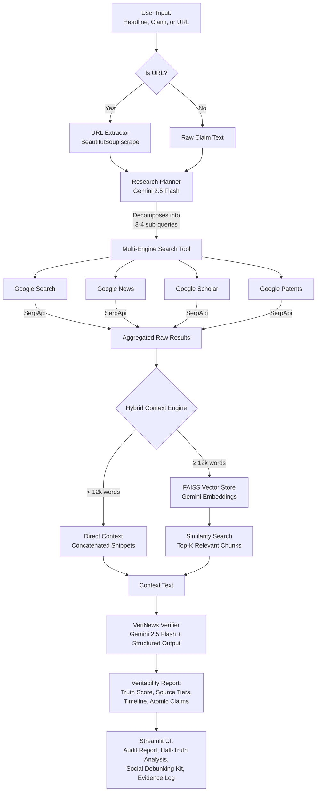

# VeriNews AI — Autonomous Real-Time Fact Verification Platform

VeriNews AI is an agentic fact-checking system that takes a headline, claim, or
full article URL, autonomously plans a multi-engine research strategy, executes
live searches across the web, and synthesizes a structured, source-graded
veritability report — grounded entirely in real-time evidence rather than an
LLM's static training knowledge.

## Demo Video

[](https://www.youtube.com/watch?v=K7H_3omZDDw)
*Click to watch the full walkthrough*

## Demo Deployment

https://verinewsai-3qdgmhefxyocegud7gwlm7.streamlit.app/

## The Problem

Large language models have two structural weaknesses when asked "is this
true?":

1. **Knowledge cutoff** — they cannot know about anything published after
   training, which is exactly when most viral misinformation and breaking
   news claims need checking.
2. **Hallucination without grounding** — asked to fact-check something
   confidently, an LLM will often produce a fluent, plausible-sounding
   verdict with no real evidence behind it. Static RAG (a single
   fixed-query retrieval step) helps, but doesn't decide **what** to search
   for, **which engine** is appropriate for a given sub-claim, or whether
   the evidence gathered is actually sufficient.

VeriNews AI addresses this with an **agentic research loop**: an LLM planner
decomposes the input into targeted sub-queries, routes each to the most
appropriate live search engine via SerpApi, aggregates the evidence, and only
then produces a verdict — one that can cite the specific live sources it used.

## Architecture



## How It Works

1. **Input & Extraction** — Accepts a raw claim/headline or a full article URL.
   URLs are scraped and cleaned (navigation, ads, and related-content blocks
   stripped) to isolate the actual article body before analysis.
2. **Agentic Planning** — An LLM (Gemini 2.5 Flash) analyzes the input and
   produces a structured research plan: 3-4 non-redundant sub-queries, each
   explicitly assigned to the search engine best suited to it (a scientific
   claim routes to Google Scholar, a product announcement to Google Patents
   and Google News, etc.) — this engine-routing decision is what makes this
   an *agentic* system rather than a fixed single-query RAG pipeline.
3. **Multi-Engine Execution** — Each sub-query is executed live via SerpApi,
   with retry/exponential-backoff logic for rate limits or transient
   failures, and graceful empty-result handling rather than hard failures.
4. **Hybrid Evidence Routing** — Small evidence sets are passed directly as
   context. Large evidence sets (a broadly-covered claim can pull well over
   12,000 words of snippets) are indexed into a FAISS vector store and
   narrowed via similarity search to the most relevant chunks — preventing
   context-window overflow while preserving the most pertinent evidence.
5. **Structured Verification** — A second LLM pass evaluates the claim
   strictly against the retrieved evidence, producing a schema-validated
   report: an overall truth score, per-claim status (VERIFIED /
   UNVERIFIED / CONTRADICTED) with citations, a source-credibility tier
   breakdown (academic/official vs. mainstream news vs. unverified web),
   and a claim-origin timeline.

## SerpApi Integration

SerpApi is the system's sole source of live, real-time evidence — without it,
this is just an LLM guessing. Four engines are integrated, each mapped to a
distinct evidentiary purpose:

| Engine | Purpose | Why it matters here |
| --- | --- | --- |
| `google_search` | General web corroboration | Broadest coverage for factual/legal claims |
| `google_news` | Recent event tracking | Essential for claims involving breaking news the LLM couldn't have seen during training |
| `google_scholar` | Academic/scientific literature | Grounds health and scientific claims in peer-reviewed sources, not just news commentary |
| `google_patents` | IP filings & technical specs | Verifies claims about inventions, product announcements, and technical specifications against official filings |

**Why live web data was essential, not optional:** a static, pre-indexed
knowledge base (traditional RAG) cannot verify a claim published an hour ago,
and an LLM's parametric memory cannot either. SerpApi is what allows the
verifier to ground its verdict in evidence that is provably *current* —
the system's "Parametric Baseline" comparison view in the UI makes this
concrete, showing side-by-side what an unassisted model says vs. what the
live-evidence-grounded system concludes.

Engine selection is not hardcoded per query type — the **planner LLM decides
at runtime** which engine(s) best fit each sub-query it generates, based on
the nature of the specific claim being audited.

## Tech Stack

- **LLM:** Google Gemini 2.5 Flash (planning + structured verification)
- **Live Search:** SerpApi (Google Search, News, Scholar, Patents)
- **Vector Store:** FAISS (`langchain-community`), Gemini embeddings
- **Frontend:** Streamlit
- **Scraping:** BeautifulSoup4
- **Schema Validation:** Pydantic

## Running Locally

```bash
pip install -r requirements.txt
```

Create a `.env` file:
    GEMINI_API_KEY=your_key_here
    SERPAPI_API_KEY=your_key_here

Run:

```bash
streamlit run app.py
```

## Known Limitations

- Planning currently executes as a single upfront batch (plan → search →
  verify once) rather than an iterative loop that re-searches if initial
  evidence proves insufficient — a natural next step for deeper agentic
  behavior.
- SerpApi rate limits apply per plan; very broad claims generating many
  sub-queries across all four engines will consume quota faster.
- Fact-checking quality is bounded by SerpApi's indexed search results —
  claims with genuinely sparse web coverage will correctly resolve as
  UNVERIFIED rather than fabricating certainty either way.
