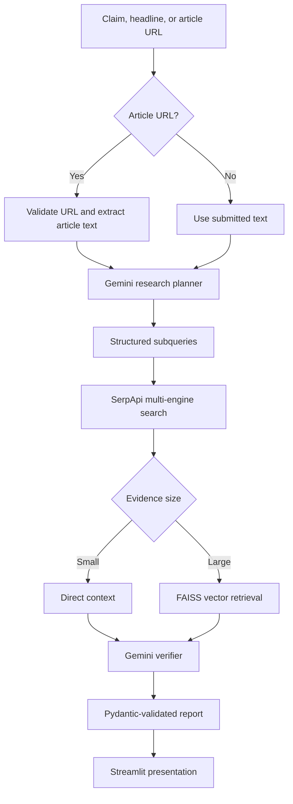

# VeriNews AI

[](https://github.com/fafnirkyu/verinewsai/actions/workflows/tests.yml)

VeriNews AI is a hackathon prototype for evidence-assisted fact checking. It accepts a claim, headline, or article URL; creates a research plan; searches several live indexes through SerpApi; and asks Gemini to produce a structured report grounded in the retrieved evidence.

The application is a research aid, not an authoritative fact-checking service. Its truth score is generated by an LLM and is not a calibrated probability.

## Demo

- [Open the Streamlit deployment](https://verinewsai-3qdgmhefxyocegud7gwlm7.streamlit.app/)
- [Watch the project walkthrough](https://www.youtube.com/watch?v=K7H_3omZDDw)

[](https://www.youtube.com/watch?v=K7H_3omZDDw)

## What it does

- Accepts a raw claim, headline, or public HTTP/HTTPS article URL.
- Uses Gemini 2.5 Flash to create a structured research plan.
- Routes subqueries to Google Search, Google News, Google Scholar, or Google Patents through SerpApi.
- Formats smaller evidence sets directly and uses FAISS retrieval for larger contexts.
- Produces a Pydantic-validated report containing a truth score, atomic claim statuses, source tiers, citations, and a timeline.
- Presents the result in a Streamlit interface with an evidence log and shareable briefing text.
- Rejects article URLs that resolve to private, loopback, link-local, or reserved network addresses.

## Architecture



## Evidence workflow

1. **Input handling:** Raw text is used directly. Public article URLs are validated, fetched with controlled redirects, and reduced to primary page content.
2. **Planning:** Gemini decomposes the input into short, engine-specific research queries.
3. **Search:** SerpApi retrieves live results from the selected web, news, academic, and patent indexes.
4. **Context preparation:** Smaller result sets are concatenated. Larger sets are embedded and retrieved through FAISS.
5. **Verification:** Gemini evaluates atomic claims against the supplied context and returns a structured report.
6. **Validation:** Pydantic rejects unsupported statuses, scores outside 0–100, and negative source counts.

## Project structure

```text
.
├── agent/
│   ├── context_manager.py       # Direct-context and FAISS evidence routing
│   ├── planner.py               # Research-plan generation and execution
│   ├── planner_schema.py        # Structured planning models
│   ├── url_extractor.py         # URL safety checks and article extraction
│   ├── verifier.py              # Evidence-grounded report generation
│   └── verifier_schema.py       # Report validation models
├── serpapi_tools/
│   └── multi_engine_search.py   # Search execution and result normalization
├── tests/
│   ├── test_url_extractor.py
│   └── test_verifier_schema.py
├── .env.example
├── app.py                       # Streamlit application
├── pipeline_telemetry.py        # Live integration and latency telemetry
├── requirements.txt
└── requirements-ci.txt
```

## Local setup

The commands below use Windows PowerShell and Python 3.10 or later.

```powershell
git clone https://github.com/fafnirkyu/verinewsai.git
cd verinewsai

python -m venv .venv
.\.venv\Scripts\Activate.ps1
python -m pip install -r requirements.txt

Copy-Item .env.example .env
```

Add your API keys to `.env`:

```env
GEMINI_API_KEY=your-gemini-api-key
SERPAPI_API_KEY=your-serpapi-api-key
```

Start the interface:

```powershell
python -m streamlit run app.py
```

Streamlit deployments can provide the same two values through `secrets.toml` or the platform's secrets settings. Do not commit either file with real credentials.

## Tests

The automated suite is deliberately offline: HTTP responses and DNS results are replaced with controlled test data, and no Gemini or SerpApi quota is consumed.

```powershell
python -m pip install -r requirements-ci.txt
python -m pytest -q
```

GitHub Actions runs these tests on every push and pull request.

## Live pipeline telemetry

`pipeline_telemetry.py` exercises the real API-backed workflow and reports latency, query counts, source counts, structured output counts, and failures:

```powershell
python pipeline_telemetry.py
```

This command consumes Gemini and SerpApi quota. It is an integration and performance check, not an accuracy benchmark: the included cases do not contain labeled expected answers.

## Technology stack

- Python 3.10+
- Streamlit
- Gemini 2.5 Flash and Gemini embeddings
- LangChain
- SerpApi
- FAISS
- Pydantic
- Beautiful Soup and Requests
- Pytest and GitHub Actions

## External services and data handling

- Submitted claims, extracted article text, and retrieved evidence are sent to Google Gemini for planning and verification.
- Generated search queries are sent to SerpApi.
- When a user submits an article URL, the application server requests that public page.
- API keys entered in the sidebar are assigned to the running process for that session and are not written to repository files by the application.

Do not submit confidential material to the hosted demo.

## Current limitations

- Planning is a single plan-search-verify pass; the system does not autonomously re-plan when evidence is insufficient.
- Most evidence consists of search-result titles and snippets rather than complete source documents.
- Source tiers and truth scores are model-generated judgments, not independently calibrated measurements.
- Results depend on the coverage, ranking, availability, and rate limits of external APIs.
- Retrieved web content is untrusted and the prototype has not been comprehensively hardened against indirect prompt injection.
- DNS and redirect validation block common server-side request-forgery targets, but the prototype has not undergone a professional security review.
- Outputs should be checked against the cited primary sources before being used for medical, legal, financial, journalistic, or safety-critical decisions.
